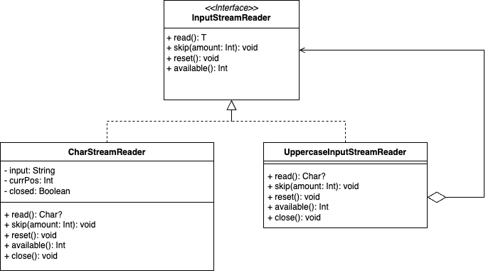

# Delegation With I/O Streams (Sample)

When we need to add extra logic to a class, patterns like the Decorator often come to mind. These patterns help us achieve flexibility and extensibility.

In Kotlin, we can take this concept further with class delegation. It allows us to delegate function calls to another class with less boilerplate. But have you ever wondered how this works under the hood?

One of the most iconic examples of decoration in the JVM ecosystem is I/O Streams. Streams are built by wrapping one stream with another, adding layers of functionality along the way. Inspired by this, let’s explore how Kotlin’s class delegation can simplify such patterns. We'll create a simple, illustrative example—a stream that may not serve a practical purpose but demonstrates how to make delegation more idiomatic in Kotlin.

### What are IO Streams in Java
An I/O Stream represents an input source or an output destination. A stream can represent many different kinds of sources and destinations, including disk files, devices, other programs, and memory arrays.

Streams support many different kinds of data, including simple bytes, primitive data types, localized characters, and objects. Some streams simply pass on data; others manipulate and transform the data in useful ways.

No matter how they work internally, all streams present the same simple model to programs that use them: A stream is a sequence of data. A program uses an input stream to read data from a source, one item at a time

## High-level design



## Implementation

### Creating an inner stream

Let’s start by defining our inner stream. This stream takes a **String** as input and allows reading it character by character:


``` kotlin
class CharStreamReader(private val input: String) : InputStreamReader<Char?> {  
   private var currPos = 0  
   private var closed = false  
  
   override fun read(): Char? {  
        ensureOpen()  
  
        val length = input.length
        if (length == 0 || currPos == length) return null  
  
        return input[currPos++]  
    }  
  
    override fun skip(amount: Int) {  
        ensureOpen()  
  
        val newPos = amount + currPos
        require(newPos < input.length) { "Skipped amount exceeds input length" }  
  
        currPos = newPos  
    }  
  
    override fun reset() {  
        ensureOpen()  
        currPos = 0  
    }  
  
    override fun available(): Int = if (closed) 0 else input.length - currPos  
  
    override fun close() {  
        closed = true  
    }  
  
    private fun ensureOpen() = check(closed.not()) { "Stream is already closed" }
}
```

### Creating an outer stream

Now, let’s move on to the outer stream. The inner stream is fairly detailed, implementing multiple methods. However, for the outer stream, we only want to override the read() method while delegating the rest to the inner stream (**CharStreamReader**).


#### The Old Way

Using the traditional approach, we override the methods we want to modify and delegate the rest directly to the inner stream. While this gets the job done, it’s quite verbose.

``` kotlin
class UppercaseInputStreamReaderOldWay(private val innerStream: InputStream<Char?>) : InputStreamReader<Char?> {
    override fun read(): Char? {
        val char = innerStream.read()
        return char?.uppercaseChar()
    }

    override fun skip(amount: Int) = innerStream.skip(amount)

    override fun reset() = innerStream.reset()
    
    override fun available(): Int = innerStream.available()

    override fun close() = innerStream.close()
}
```

#### A Better Way with Kotlin Delegation

Kotlin offers a more elegant solution: class delegation. It lets us reduce boilerplate code while achieving the same functionality. Here's how it looks in practice.

``` kotlin
class UppercaseInputStreamReader(private val innerStream: InputStream<Char?>) : InputStreamReader<Char?> by innerStream {
    override fun read(): Char? {
        val char = innerStream.read()
        return char?.uppercaseChar()
    }
}
```

### Final Thoughts

If you’re curious about what happens behind the scenes, you can inspect the generated bytecode. In IntelliJ IDEA or Android Studio, navigate to:
**Tools -> Show Kotlin Bytecode -> Decompile.**

You’ll notice that the result is identical to the previous verbose example. Kotlin simply eliminates the boilerplate for you, providing a more concise and elegant solution while keeping the same functionality under the hood.

Feel free to download the code and give it a try yourself!
